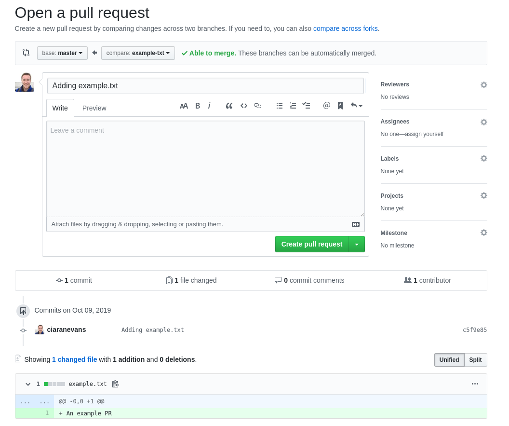
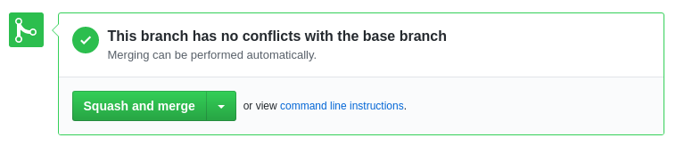

# How to raise a Pull Request

Firstly, you will need to create a branch to do your work on:

```
$ git checkout -b <name-of-your-branch>
```

When you have done whatever it is you're working on, do the usual commit process e.g.:

### Do 'Work'
```
$ echo "An example PR" >> example.txt
```

### Checking what 'Work' we've done
```
$ git status
# On branch example-txt
# Untracked files:
#   (use "git add <file>..." to include in what will be committed)
#
#	example.txt
nothing added to commit but untracked files present (use "git add" to track)
```

### Creating a commit with our 'Work'
```
$ git add -A
$ git commit -m "Adding example.txt"

[example-txt fb672d4] Adding example.txt
 1 file changed, 1 insertion(+)
 create mode 100644 example.txt
```

### Pushing up your 'Work' to the remote repository
```
$ git push -u origin <name-of-your-branch>
```

### GitHub

Go to your repository and you should see something like:


Click `Compare & pull request`

You will then see a page like:



Add in any relevant information about what the Pull Request contains (What work has been done etc.)

If your Pull Request will complete a ticket/story/issue, you can use `Closes #<A number>` in the text box, when the Pull Request is merged, the linked issue will also be closed.

You can assign yourself to the work on the right, ask for reviewers (If you want) and assign it labels, a project, and a milestone.

When ready, click `Create Pull Request`

If all goes well and no conflict are found or someone hasn't torn it apart in a review, you can merge the Pull Request.

From the dropdown, select `Squash and merge` - This will create 1 commit on Master that contains all commits with the Pull Request (This keeps things on Master tidy):



When you click the big green button, you'll be asked to edit the commit message if you wish, then you will need to click `Confirm squash and merge`, once this is done, you will see:


Congrats! You're done!

You can now delete that branch if you wish, it keeps the repo tidy.

Now anyone that pulls master will have your work!


